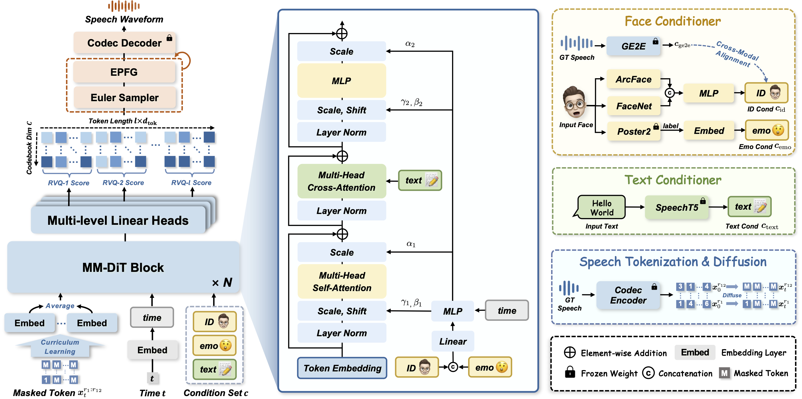

    

    
    

     

    Official project of demo samples for  
    <b><em>Emotional Face-to-Speech</em></b>
    

         
    
    
    
    

### 📰 News
* 03/02/2025 Released the Web project.
  

### 📕Introduction

How much can we infer about an emotional voice solely from an expressive face? This intriguing question holds great potential for applications such as virtual character dubbing and aiding individuals with expressive language disorders. In this paper, we explore a new task, termed *emotional face-to-speech*, aiming to synthesize emotional speech directly from expressive facial cues.  To that end, we introduce **DEmoFace**, a novel generative framework that leverages a discrete diffusion transformer (DiT) with curriculum learning, built upon a multi-level neural audio codec. 

    

    
    

